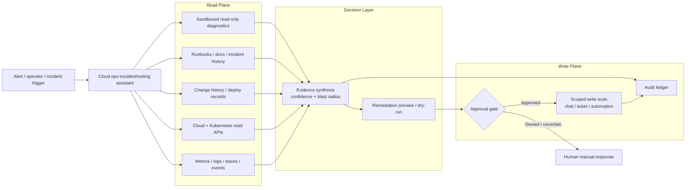

# Cloud ops troubleshooting assistant

> **SAFE‑AUCA industry reference guide (draft)**
>
> This use case describes a real-world workflow where a cloud operations / SRE assistant investigates production issues by correlating alerts, logs, metrics, traces, topology, deployment history, configuration state, and runbooks; optionally runs allowlisted **read-only** diagnostics; and proposes bounded remediation steps under change-control.
>
> It focuses on:
> - how the workflow works in practice (tools, data, trust boundaries, autonomy)
> - what can go wrong (defender-friendly kill chain)
> - how it maps to **SAFE‑MCP techniques**
> - what controls + tests make it safer
>
> **Defender-friendly only:** do **not** include operational exploit steps, payloads, or step-by-step attack instructions.  
> **No sensitive info:** do not include internal hostnames/endpoints, secrets, customer data, non-public incidents, or proprietary details.

---

## Metadata

| Field | Value |
|---|---|
| **SAFE Use Case ID** | `SAFE-UC-0023` |
| **Status** | `draft` |
| **NAICS 2022** | `51` (Information), `518210` (Computing Infrastructure Providers, Data Processing, Web Hosting, and Related Services) |
| **Workflow family** | `Cloud operations / SRE / incident response` |
| **Last updated** | `2026-03-18` |

### Evidence (public links)

- [SAFE-AUCA use-case template](https://github.com/safe-agentic-framework/safe-agentic-use-cases/blob/main/templates/use-case-template.md)
- [SAFE-UC-0023 planning issue](https://github.com/safe-agentic-framework/safe-agentic-use-cases/issues/21)
- [Amazon CloudWatch investigations](https://docs.aws.amazon.com/AmazonCloudWatch/latest/monitoring/Investigations.html)
- [Amazon Q Developer operational investigations in chat applications](https://docs.aws.amazon.com/chatbot/latest/adminguide/monitoring-investigations.html)
- [AWS services where investigations are supported](https://docs.aws.amazon.com/AmazonCloudWatch/latest/monitoring/Investigations-Services.html)
- [Datadog Bits AI SRE](https://docs.datadoghq.com/bits_ai/bits_ai_sre/)
- [Datadog Bits AI SRE — Investigate Issues](https://docs.datadoghq.com/bits_ai/bits_ai_sre/investigate_issues/)
- [Datadog Bits AI SRE — Configure Integrations and Settings](https://docs.datadoghq.com/bits_ai/bits_ai_sre/configure/)
- [Datadog Bits AI SRE — Take Action](https://docs.datadoghq.com/bits_ai/bits_ai_sre/take_action/)
- [Gemini Cloud Assist overview](https://docs.cloud.google.com/cloud-assist/overview)
- [Create a Cloud Assist investigation](https://docs.cloud.google.com/cloud-assist/create-investigation)
- [PagerDuty Event Orchestration / Automation Actions](https://support.pagerduty.com/main/docs/event-orchestration)
- [Prometheus Querying Basics](https://prometheus.io/docs/prometheus/latest/querying/basics/)
- [Kubernetes RBAC Good Practices](https://kubernetes.io/docs/concepts/security/rbac-good-practices/)
- [Model Context Protocol specification](https://modelcontextprotocol.io/specification/2025-06-18)
- [Model Context Protocol tools specification](https://modelcontextprotocol.io/specification/2025-06-18/server/tools)
- [Model Context Protocol sampling specification](https://modelcontextprotocol.io/specification/2025-11-25/client/sampling)
- [OWASP LLM Prompt Injection Prevention Cheat Sheet](https://cheatsheetseries.owasp.org/cheatsheets/LLM_Prompt_Injection_Prevention_Cheat_Sheet.html)
- [NIST AI Risk Management Framework](https://www.nist.gov/itl/ai-risk-management-framework)
- [NIST AI RMF: Generative AI Profile (AI 600-1)](https://www.nist.gov/publications/artificial-intelligence-risk-management-framework-generative-artificial-intelligence)
- [Cloud Security Alliance AI Controls Matrix (AICM)](https://cloudsecurityalliance.org/artifacts/ai-controls-matrix)

---

## Minimum viable write-up (Seed → Draft fast path)

This draft completes the core seed → draft items for `SAFE-UC-0023`:

- Executive summary
- Industry context & constraints
- Workflow + scope
- Architecture (tools + trust boundaries + inputs)
- Operating modes
- Kill-chain table
- SAFE-MCP mapping table
- Version History (initial row added)

---

## 1. Executive summary (what + why)

**What this workflow does**  
A cloud ops troubleshooting assistant helps on-call teams investigate incidents by assembling operational context from observability systems, recent changes, cloud/Kubernetes state, service ownership data, and runbooks. It can iteratively test hypotheses with **read-only** queries and sandboxed diagnostics, then return an evidence-backed summary, likely blast radius, and proposed next actions.

**Why it matters (business value)**  
This workflow reduces mean time to acknowledge and mean time to isolate likely causes, especially in noisy or high-cardinality environments where engineers must correlate multiple systems under time pressure. It also improves consistency of triage, reduces cognitive load for on-call responders, and preserves institutional knowledge in reusable runbooks and post-incident artifacts.

**Why it is risky / what can go wrong**  
The same workflow is dangerous because it ingests large volumes of **untrusted or semi-trusted** content—especially logs, incident text, deployment notes, documentation, and tool responses—into a single decision loop. If the assistant has over-broad permissions or can trigger remediation automatically, poisoned context or compromised tools can turn a wrong diagnosis into a real production outage, data leak, or change-control bypass.

---

## 2. Industry context & constraints (reference-guide lens)

### Where this shows up

This pattern is common across:

- SaaS platform teams running globally distributed services
- internal SRE / platform engineering teams operating Kubernetes and cloud-native estates
- managed service providers and cloud operations centers
- multi-cloud enterprise operations teams integrating observability, ITSM, and automation platforms
- incident response workflows embedded into chat, ticketing, and runbook systems

### Typical systems in this workflow

- **Observability and AIOps:** Datadog, CloudWatch / Amazon Q, Prometheus-compatible backends, logging and tracing platforms
- **Resource/control plane:** AWS, Google Cloud, Azure, Kubernetes, service meshes, load balancers, autoscalers
- **Change sources:** CI/CD, GitOps, deployment records, change calendars, feature-flag systems
- **Knowledge sources:** runbooks, internal docs, CMDB / service catalog, prior incident summaries
- **Coordination systems:** PagerDuty, ticketing / case management, chat, status pages
- **Automation systems:** runbook automation, serverless jobs, SSM/automation documents, guarded shell or container runners

### Constraints that matter

- **Availability first:** during a live incident, the system must not worsen the outage while attempting to help.
- **Separation of duties:** the actor who investigates is often not the same actor who authorizes or executes production change.
- **Noisy, attacker-influenced inputs:** workload logs, HTTP payloads, traces, and incident text may contain arbitrary user-controlled content.
- **Partial and stale truth:** metrics lag, logs are sampled or delayed, traces are incomplete, and docs/runbooks can drift.
- **High change velocity:** deployments, autoscaling, ephemeral infrastructure, and feature flags make causality hard to establish.
- **Auditable operations:** incident handling, change approvals, and post-incident records typically require immutable evidence.
- **Inherited compliance scope:** the assistant often touches systems that may include secrets, customer identifiers, regulated data, or sensitive topology.

### Must-not-fail outcomes

- self-inflicted service outage caused by a wrong or over-broad remediation
- unauthorized write action in production
- exposure of secrets, customer data, or internal topology through summaries, chat posts, or tickets
- incorrect rollback, failover, scaling, or instance termination
- polluted incident memory that causes repeated future misdiagnosis
- missing audit trail for a production-impacting action

### Operational constraints

- minutes-level triage expectations during incidents
- strong bias toward **read-only** investigation by default
- need for reversible, low-blast-radius changes when intervention is necessary
- change-window and approval requirements for write-capable actions
- limited tolerance for false confidence or fabricated root-cause claims

---

## 3. Workflow description & scope

### 3.1 Workflow steps (happy path)

1. **Trigger**  
   An investigation starts from a monitor alert, CloudWatch alarm, incident page, chat command, ticket, or operator prompt.

2. **Context assembly**  
   The assistant gathers the initial bundle: alert metadata, service ownership, recent deployments and configuration changes, topology/dependency hints, recent incidents, and relevant runbooks.

3. **Telemetry interrogation**  
   The assistant queries metrics, logs, traces, and events to identify anomalies, time alignment, saturation/error patterns, and likely affected dependencies.

4. **Hypothesis formation and refinement**  
   The assistant proposes several explanations, looks for confirming and disconfirming evidence, and lowers confidence when evidence conflicts or is incomplete.

5. **Read-only diagnostics**  
   Where allowed, the assistant runs sandboxed, allowlisted **read-only** scripts or commands (for example: resource description, health checks, non-mutating API reads, kube object inspection, dependency reachability tests).

6. **Findings and remediation preview**  
   The assistant returns an evidence-backed summary: likely root cause(s), confidence level, affected services or tenants, suggested next best actions, and a dry-run / preview of any proposed remediation.

7. **Approval gate for writes**  
   Any production-impacting action—restart, failover, scaling override, feature-flag change, config mutation, ticket state change with external effect, or runbook execution—passes through human approval and strong authorization.

8. **Execution and post-incident capture**  
   Approved actions are executed through scoped automation. The incident record captures tool calls, evidence, rationale, outcome, and (optionally) reviewed learnings for future investigations.

### 3.2 In scope / out of scope

- **In scope:** incident triage, telemetry correlation, read-only cloud/Kubernetes inspection, allowlisted read-only diagnostics, runbook retrieval, draft RCA generation, remediation planning, internal ticket/chat drafting, approval-gated automation.
- **Out of scope:** unrestricted shell access, self-approving production change, wildcard cloud admin access, broad secret enumeration, customer-facing communications without approval, autonomous destructive remediation, undocumented “one-off” diagnostics outside policy.

### 3.3 Assumptions

- Read and write tool paths are separable and independently permissioned.
- Telemetry backends, cloud APIs, and knowledge sources provide auditable access logs.
- Diagnostic scripts are versioned, allowlisted, and executed in an isolated runtime.
- Production write actions require explicit authorization beyond ordinary read access.
- The assistant is expected to produce evidence-backed outputs, not unsupported certainty.
- Organizations may optionally enable long-term incident memory; if so, it is reviewable and governed.

### 3.4 Success criteria

Good looks like:

- reduced MTTA / MTTR without increasing unsafe changes
- no unauthorized production writes
- no secret or customer-data leakage in outputs
- evidence-backed recommendations with confidence and provenance
- repeatable, auditable investigation records
- safe fallback to manual operations when confidence is low or policy is uncertain

---

## 4. System & agent architecture

### 4.1 Actors and systems

- **Human roles:** on-call engineer, service owner, incident commander, change approver, platform/SRE admin, security reviewer
- **Agent/orchestrator:** troubleshooting agent runtime with retrieval, planning, policy evaluation, and tool-execution control
- **Tools (MCP servers / APIs / connectors):** observability queries, cloud and Kubernetes describe/read APIs, deployment/change feeds, runbook/document retrieval, isolated diagnostics runner, ticket/chat integrations, optional remediation automation
- **Data stores:** telemetry stores, cloud/Kubernetes state, service catalog / CMDB, docs/runbooks, incident records, audit logs, optional vector memory
- **Downstream systems affected:** incident channels, tickets, case systems, automation engines, and—only with approval—production services and infrastructure

### 4.1.1 Reference architecture (high level)

### 4.2 Trusted vs untrusted inputs

| Input/source | Trusted? | Why | Typical failure / abuse pattern | Mitigation theme |
|---|---|---|---|---|
| Alert title/body, incident chat, ticket text | Untrusted | human-authored or externally influenced | prompt injection, social engineering, urgency framing | treat as data only, provenance, approval discipline |
| Application logs / error payloads | Untrusted | workloads often emit user-controlled strings | hidden instructions, secret leakage, misleading narratives | sanitization, truncation, structured parsing, redaction |
| Traces and events | Mixed | mostly machine-generated but can contain app/user payloads | contaminated span attributes, false breadcrumbs | field allowlists, schema checks, selective retrieval |
| Metrics and SLO signals | Semi-trusted | machine-generated but can be stale or manipulated by compromised agents | false confidence, misleading correlations | cross-source corroboration, time-window validation |
| Cloud / Kubernetes resource state | Semi-trusted | authoritative but may be partial, delayed, or compromised | stale status, missing context, privilege overreach | least privilege, scoped reads, freshness indicators |
| Deployment / config / feature-flag history | Semi-trusted | internal system-of-record but can be incomplete or noisy | wrong causality, rollback to incorrect version | signed change records, change correlation, diff review |
| Runbooks / docs / KB pages | Semi-trusted | internal but can be stale, unsafe, or maliciously edited | bad guidance, policy drift, unsafe commands | provenance, review, versioning, expiration |
| Tool outputs / connector responses | Mixed | quality depends on tool/server integrity | schema poisoning, response tampering, hidden instructions | output validation, trusted-server allowlists, tool ledger |
| Long-term memory / prior incident summaries | Semi-trusted | persistent but subject to contamination or overgeneralization | recurring false guidance, memory poisoning | reviewed writes, TTL, integrity checks, purge path |

### 4.3 Trust boundaries (required)

1. **Trigger boundary:** monitor alerts, incident text, chat messages, and operator prompts cross into agent context.
2. **Telemetry boundary:** untrusted workload-generated content travels through observability systems into the assistant.
3. **Knowledge boundary:** internal docs, prior incidents, and memory stores enter the decision loop even though they are not always current or trustworthy.
4. **Execution boundary:** the assistant translates reasoning into concrete tool calls or scripts.
5. **Control-plane boundary:** cloud/Kubernetes/change APIs can shift the system from observation to production impact.
6. **Coordination boundary:** assistant outputs propagate into tickets, chat, and case systems where humans may act on them.
7. **Environment boundary:** dev/test, staging, and production differ in blast radius and must not silently share write credentials.

**Trust boundary notes**

- The most important safety boundary in this use case is the transition from **read-only investigation** to **write-capable control-plane action**.
- Tool annotations, tool descriptions, and connector metadata should be treated as untrusted unless they originate from explicitly trusted servers.
- Production write credentials should never be shared with the same unrestricted execution context used for general investigation.
- If memory is enabled, memory write is itself a trust boundary because it can affect future incidents.

### 4.4 Tool inventory (required)

| Tool / MCP server | Read / write? | Permissions | Typical inputs | Typical outputs | Failure modes |
|---|---|---|---|---|---|
| `incident.context.get` | read | alert/ticket/channel scoped | incident id, service, time window | alert metadata, owners, severity, links | stale or incomplete context |
| `metrics.query` | read | observability read role | service, label set, time range, query | time series, anomalies, saturation/error trends | misleading aggregation, wrong query scope |
| `logs.query` | read | log read role | service, query terms, time range | log lines, structured fields, counts | untrusted text injection, secret exposure |
| `traces.query` | read | tracing/APM read role | trace id, service, endpoint, time range | spans, latency/error breakdown, dependency paths | contaminated span attributes, partial traces |
| `inventory.describe` | read | cloud/k8s read role | resource ids, namespaces, clusters, accounts | resource state, config, events, identities | cross-env confusion, stale object state |
| `changes.list_recent` | read | CI/CD or GitOps read role | service, env, time range | deploys, config diffs, feature-flag changes | missing causal change, noisy change sets |
| `runbook.retrieve` | read | doc/KB read role | service, symptom, incident type | runbooks, SOPs, linked diagnostics | stale or unsafe runbook guidance |
| `diagnostics.run_readonly` | exec/read | allowlisted sandbox identity | approved script id, args, target scope | command output, parsed health checks, artifacts | sandbox escape, hidden side effects, over-broad target |
| `remediation.preview` | read/simulate | simulation or dry-run role | candidate action, target resource, policy context | blast-radius estimate, dry-run diff, rollback hints | false assurance, incomplete simulation |
| `memory.store_case_note` *(optional)* | write | reviewed memory writer role | approved summary, tags, confidence | memory entry id / status | persistent contamination, overfitting |
| `ticket_or_chat.update` | write | scoped collaboration role | summary, evidence, recipients, incident id | post/ticket update result | leakage, premature or misleading communication |
| `remediation.execute` | write | tightly scoped change role | pre-approved action id, targets, approval id | execution status, before/after state | service disruption, privilege abuse, change bypass |
| `audit.append` | write | immutable logging role | session id, tool call metadata, decisions | audit event id | missing or altered evidence trail |

### 4.5 Governance & authorization matrix

| Action category | Example actions | Allowed mode(s) | Approval required? | Required auth | Required logging / evidence |
|---|---|---|---|---|---|
| Read-only retrieval | query metrics/logs/traces; read deployment history | manual / HITL / autonomous | no | user session or service-scoped read token | query logs, scope, timestamps |
| Read-only diagnostics | run allowlisted health checks or object inspection | HITL / autonomous | policy-based; usually no | sandbox executor identity | script id, args, target scope, artifacts |
| Internal incident drafting | draft timeline update, RCA summary, Jira note | HITL / autonomous | policy-based | scoped collaboration role | posted content, source links, reviewer if any |
| Memory persistence | save incident learnings or feedback for future reuse | HITL initially | yes | reviewed memory-writer role | submitted content, approver, TTL, provenance |
| Remediation preview | simulate restart, rollback, scale, failover | HITL / autonomous | no | simulation role | dry-run output, blast-radius score |
| Non-production write | restart dev/stage pod, update test ticket state | HITL / autonomous | yes or policy-based | environment-scoped write role | before/after diff, approval record |
| Production bounded remediation | execute pre-approved restart / failover / rollback in prod | HITL only | always | step-up auth + scoped prod role | approval id, target set, rationale, rollback plan |
| High-risk production action | broad scale-down, route change, IAM/policy mutation, cluster-wide action | manual / HITL only | always, often dual approval | break-glass or elevated role | immutable audit trail, risk classification, reviewers |
| External communications | status page update, customer-facing message | HITL initially | yes | verified identity | archived message, approver, timestamps |

### 4.6 Sensitive data & policy constraints

- **Data classes:** secrets/tokens, customer identifiers, tenant metadata, request payload fragments, error traces, internal topology, IAM configuration, ticket text, and post-incident analysis.
- **Retention / logging constraints:** raw telemetry should not be copied indiscriminately into long-lived prompts, chat transcripts, or memory stores. Logs should prefer references, hashes, excerpts, or redacted fields over full payload duplication.
- **Regulatory constraints:** the workflow inherits the compliance obligations of the workloads it touches (for example: privacy, payment, healthcare, export, or contractual restrictions). The agentic layer should not widen data access beyond existing operational need.
- **Safety constraints:** no autonomous action should create a larger blast radius than the incident itself; ambiguous evidence should reduce confidence and expand human review rather than accelerate automation.
- **Change-control constraints:** any production write path should bind to an approval object, execution scope, and rollback path.

---

## 5. Operating modes & agentic flow variants

### 5.1 Manual baseline (no agent)

- On-call engineers pivot across dashboards, logs, traces, cloud consoles, ticket systems, and runbooks manually.
- Humans decide which signals matter, which commands are safe, and when to ask for change approval.
- Existing controls usually include RBAC, peer escalation, change windows, documented runbooks, and incident commander oversight.
- Humans catch ambiguity by noticing contradictions between evidence sources and by refusing to act on unclear guidance.

### 5.2 Human-in-the-loop (HITL / sub-autonomous)

- The assistant automatically gathers context, correlates telemetry, runs allowlisted **read-only** diagnostics, and drafts findings.
- Humans review the proposed remediation, choose whether to send internal updates, and approve any production-impacting write.
- Approval gates sit before remediation execution, memory persistence, external communications, and other high-consequence actions.
- This is the **recommended default mode** for most real-world deployments of this use case.

### 5.3 Fully autonomous (end-to-end agentic)

- A fully autonomous variant may be acceptable only for narrow, bounded actions such as ticket enrichment, auto-investigation launch, or low-risk, reversible responses in non-production or tightly scoped canaries.
- In production, fully autonomous write-capable remediation is **not a safe default** for this workflow unless it is restricted to pre-authorized, low-blast-radius actions with strong policy checks, rate limits, canary targeting, rollback automation, and a kill switch.
- Even when automation is allowed, the assistant should not have broad shell access, wildcard cluster permissions, or general-purpose cloud admin roles.
- The main blast radius comes from a wrong diagnosis turning into an authoritative action against healthy capacity or shared control-plane state.

### 5.4 Variants

- **Chat-first variant:** operator interacts through Slack / Teams / incident bridge.
- **Monitor-triggered variant:** alert automatically opens an investigation and populates context before a human arrives.
- **Multi-agent variant:** separate retriever, hypothesis scorer, communications drafter, and execution gatekeeper.
- **Vendor-native variant:** cloud or observability provider offers built-in investigations and curated automations.
- **Platform-built variant:** organization composes MCP/API connectors, internal runbooks, and policy engines.

---

## 6. Threat model overview (high-level)

### 6.1 Primary security & safety goals

- preserve service availability and avoid self-inflicted outage amplification
- preserve integrity of diagnosis, evidence, and change-control decisions
- prevent secrets or sensitive telemetry from leaking through assistant outputs or tool calls
- ensure all write actions are attributable, reviewable, and reversible

### 6.2 Threat actors (who might attack / misuse)

- external attacker who can influence workload inputs that appear in logs, traces, or tickets
- compromised workload or collector emitting poisoned telemetry
- malicious or careless insider editing runbooks, docs, tickets, or memory
- compromised third-party connector, MCP server, or integration
- stressed responder who over-trusts confident but wrong assistant output during an incident

### 6.3 Attack surfaces

- log lines, exception text, span attributes, alerts, and incident summaries
- runbooks, Confluence/KB pages, recent change descriptions, PRs, deployment notes
- tool descriptions, annotations, and connector metadata
- diagnostic script arguments, shell wrappers, and automation inputs
- vector memory or stored learnings from prior incidents
- cloud/Kubernetes APIs and write-capable runbook automation

### 6.4 High-impact failures (include industry harms)

- **Customer / consumer harm:** outage duration extends; requests fail; latency spikes; customer data appears in tickets or chat; wrong failover degrades service.
- **Business harm:** service-level objective breach, incident cost escalation, on-call overload, change rollback churn, reputational damage, regulatory exposure.
- **Security harm:** unauthorized production change, secret exfiltration, integrity loss in incident records, long-term memory contamination, broadened access through over-privileged tools.

---

## 7. Kill-chain analysis (stages → likely failure modes)

> Keep this defender-friendly. Describe **patterns**, not “how to do it.”

| Stage | What can go wrong (pattern) | Likely impact | Notes / preconditions |
|---|---|---|---|
| **1. Entry / trigger** | Untrusted content enters the investigation through poisoned logs, incident text, runbooks, deployment notes, or compromised tool metadata. | Investigation starts from a contaminated context bundle. | Common when the assistant treats all retrieved text as equally trustworthy. |
| **2. Context contamination** | The assistant incorporates hidden instructions, stale guidance, or misleading evidence into its reasoning and weights the wrong hypothesis too highly. | False diagnosis, missed real root cause, or unsafe confidence. | More likely when retrieved context is not labeled by provenance, freshness, or trust level. |
| **3. Tool misuse / unsafe action** | The assistant crosses from diagnosis into action using over-privileged cloud/Kubernetes/remediation tools or unsafe diagnostics. | Production state changes, broad read access, or unauthorized automation. | Blast radius depends on credential scope, environment separation, and approval rigor. |
| **4. Persistence / repeat** | Poisoned conclusions or unsafe instructions are written back into memory, tickets, runbooks, or future automation defaults. | Recurring misdiagnosis and systematic repetition across future incidents. | Optional long-term memory increases value but also persistence risk. |
| **5. Exfiltration / harm** | Sensitive data leaks through summaries, tool parameters, tickets, or chat; or the wrong remediation terminates healthy capacity, breaks routing, or triggers self-inflicted DoS. | Security incident, privacy incident, or major availability event. | This is the failure mode highlighted in the SAFE-UC-0023 planning issue: a manipulated assistant executes a flawed remediation runbook against healthy production resources. |

---

## 8. SAFE-MCP mapping (kill-chain → techniques → controls → tests)

> Goal: make SAFE-MCP actionable in this workflow.

| Kill-chain stage | Failure / attack pattern (defender-friendly) | SAFE-MCP technique(s) | Recommended controls (prevent / detect / recover) | Tests (how to validate) |
|---|---|---|---|---|
| 1. Entry / trigger | Logs, alerts, tickets, docs, or connector metadata introduce hostile instructions into model context. | [SAFE-T1102](https://github.com/safe-agentic-framework/safe-mcp/blob/main/techniques/SAFE-T1102/README.md), [SAFE-T1001](https://github.com/safe-agentic-framework/safe-mcp/blob/main/techniques/SAFE-T1001/README.md) | Treat all retrieved text as untrusted data; apply provenance labels; keep system instructions isolated from retrieved content; verify trusted connector catalog; reject unsigned or unexpected tool metadata. | Malicious-log fixture should not change tool policy; poisoned tool-description integrity test; retrieval labeling assertion in traces/logs. |
| 2. Context contamination | Persistent memory or internal knowledge stores cause false or unsafe guidance to reappear across incidents. | [SAFE-T2106](https://github.com/safe-agentic-framework/safe-mcp/blob/main/techniques/SAFE-T2106/README.md), [SAFE-T2105](https://github.com/safe-agentic-framework/safe-mcp/blob/main/techniques/SAFE-T2105/README.md) | Review and approve memory writes; TTL/expiration for incident learnings; confidence + citation requirements; dual-source corroboration before “high confidence” conclusions; purge path for poisoned entries. | Poisoned-memory regression test; stale-runbook test; unsupported-claim test should lower confidence instead of escalating action. |
| 3. Tool misuse / unsafe action | The assistant uses over-privileged cloud/Kubernetes/remediation tools that exceed diagnostic need. | [SAFE-T1104](https://github.com/safe-agentic-framework/safe-mcp/blob/main/techniques/SAFE-T1104/README.md) | Separate read and write identities; namespace/account-scoped RBAC; no wildcard permissions; explicit deny for secrets and high-risk verbs by default; approval gate + step-up auth for production writes; dry-run before execute. | Attempted delete/scale/patch from read-only mode must fail; cross-namespace denial test; secret-read denial test; approval-gate enforcement test. |
| 4. Concealed exfiltration or misleading narrative | Sensitive data is hidden in optional tool parameters, or assistant text conceals risky tool activity from the user. | [SAFE-T1911](https://github.com/safe-agentic-framework/safe-mcp/blob/main/techniques/SAFE-T1911/README.md), [SAFE-T1404](https://github.com/safe-agentic-framework/safe-mcp/blob/main/techniques/SAFE-T1404/README.md) | Strict schema validation; reject unknown/unused JSON parameters; DLP and redaction on outputs; user-visible immutable tool ledger; correlation IDs that bind assistant narrative to actual tool activity. | Parameter-stuffing negative test; narrative-vs-tool-ledger mismatch detection; secret-redaction regression test. |
| 5. Exfiltration / harm | Wrong or manipulated remediation reaches production and creates outage amplification or persistent unsafe state. | [SAFE-T2105](https://github.com/safe-agentic-framework/safe-mcp/blob/main/techniques/SAFE-T2105/README.md), [SAFE-T1104](https://github.com/safe-agentic-framework/safe-mcp/blob/main/techniques/SAFE-T1104/README.md) | Blast-radius scoring; canary-first execution; rollback hooks; rate limits; kill switch; post-incident review before memory commit; disable autonomous production writes by default. | Self-inflicted-outage simulation in staging; rollback exercise; kill-switch drill; post-action evidence completeness check. |

**Notes**

- The technique mix changes with operating mode: autonomous write-capable deployments make **SAFE-T1104** and **SAFE-T1404** materially more important.
- The planning issue for `SAFE-UC-0023` explicitly calls out **Tool Poisoning Attack (SAFE-T1001)**, poisoned logs / indirect prompt injection, and the need for isolated diagnostics plus least-privilege RBAC; those are incorporated here.
- A practical implementation should treat “wrong but confident diagnosis” as a safety event, not merely a quality issue.

---

## 9. Controls & mitigations (organized)

### 9.1 Prevent (reduce likelihood)

- Default the workflow to **read-only** investigation.
- Split identities and credentials by capability: telemetry read, diagnostics, collaboration, memory write, and remediation execute.
- Apply least-privilege RBAC at namespace/account/project scope; avoid wildcard or cluster-admin style access.
- Treat logs, traces, alert text, tickets, docs, and tool annotations as untrusted inputs.
- Isolate instructions from retrieved context and preserve provenance/freshness labels on every evidence item.
- Allow only reviewed, versioned, allowlisted diagnostic scripts; run them in ephemeral containers or sandboxes with minimal filesystem/network permissions.
- Use dry-run / preview for remediation planning and require explicit approval objects before production execution.
- Prevent direct secret enumeration by default; deny or heavily gate reads of secrets, credentials, tokens, and sensitive config.
- Restrict memory persistence to reviewed content with TTLs, integrity metadata, and purge support.
- Require bounded target sets for any production action (for example: one service, one environment, one namespace, one cluster, or one canary slice).
- Enforce rate limits and change windows for automatic investigations and automations.
- Keep a manual fallback path and fail closed on policy ambiguity.

### 9.2 Detect (reduce time-to-detect)

- Maintain an immutable tool ledger with tool name, caller identity, scope, parameters, result hash, and timestamp.
- Detect narrative/tool mismatches where the assistant text omits or downplays risky tool activity.
- Alert on any production write attempt from a read-only session or identity.
- Detect unknown JSON parameters, schema violations, or unusual field stuffing in tool requests.
- Scan outputs for secrets, credentials, tenant identifiers, and topology leakage before posting to chat/tickets.
- Monitor for prompt-injection indicators in retrieved context, especially logs and externalized documentation.
- Track memory-store changes, unusual retrieval spikes, and poisoning-remediation events.
- Measure confidence drift: high-confidence conclusions with weak evidence should be review triggers.
- Alert on anomalous fan-out, such as one investigation touching too many clusters/accounts/services.

### 9.3 Recover (reduce blast radius)

- Provide a hard kill switch that disables all write-capable tools immediately.
- Support fast credential revocation and rotation for compromised connectors or execution identities.
- Require rollback plans or compensating actions for every production remediation class.
- Quarantine compromised integrations, runbooks, or memory entries and re-run investigations from a clean context set.
- Preserve full forensic evidence of tool activity for incident review.
- Route low-confidence or policy-uncertain cases back to manual operations without penalty.
- Perform post-incident review before promoting any learning into long-term memory or reusable runbooks.

---

## 10. Validation & testing plan

### 10.1 What to test (minimum set)

- **Permission boundaries:** the assistant cannot exceed intended scopes or invoke write actions from read-only identities.
- **Prompt/tool-output robustness:** untrusted log lines, ticket text, and docs do not alter tool policy or approval requirements.
- **Action gating:** production-impacting actions require approvals and step-up auth where applicable.
- **Logging/auditability:** every action is attributable and reviewable after the fact.
- **Rollback / safety stops:** unsafe or mistaken actions can be halted and reversed.
- **Memory safety:** long-term storage does not preserve malicious or low-quality guidance unchecked.
- **Data protection:** secrets and sensitive telemetry are redacted before user-visible output or persistence.

### 10.2 Test cases (make them concrete)

| Test name | Setup | Input / scenario | Expected outcome | Evidence produced |
|---|---|---|---|---|
| Poisoned log resilience | staging env with representative logs and alert | Inject hostile text into application log lines surfaced during investigation | Assistant treats content as evidence only; no policy change; no privileged tool request | prompt trace, tool ledger, policy-decision log |
| Over-privileged tool denial | read-only cloud/k8s identity with explicit denies | Assistant attempts delete/patch/scale during read-only investigation | Request is blocked; session remains read-only; alert raised | authz deny logs, audit event, blocked action record |
| Read-only diagnostics sandbox | isolated executor with allowlisted scripts | Diagnostic script attempts forbidden filesystem write or unrestricted network egress | Sandbox blocks disallowed side effects; investigation continues or fails closed | executor logs, seccomp/container audit, policy result |
| Remediation approval gate | production-like policy engine | Assistant proposes restart/rollback for a live-service incident | No execution without approval id and step-up auth | approval workflow record, audit trail, dry-run artifact |
| Secret redaction regression | telemetry fixture containing tokens / customer identifiers | Assistant summarizes findings to ticket/chat | Sensitive fields are redacted or withheld; summary remains usable | redaction report, output diff, ticket preview |
| Narrative/tool mismatch detection | audit-enabled test client | Assistant performs risky tool call but benignly summarizes outcome | Detection control flags mismatch and blocks completion | correlation ID, tool ledger, alert/event |
| Memory poisoning containment | optional vector-memory enabled in test env | Insert bad prior incident note or unsafe runbook guidance | Future investigation does not reuse it blindly; entry can be quarantined/purged | retrieval logs, memory provenance, quarantine record |
| Rollback / kill-switch drill | staging automation + reversible change | Assistant executes approved bounded remediation, then control plane kill switch is triggered | Further writes stop immediately; rollback procedure succeeds | execution logs, kill-switch event, rollback evidence |
| Blast-radius policy test | multi-service staging topology | Proposed remediation would target more services than allowed policy | Action is downgraded to human review or denied | risk score, policy evaluation log, denial event |

### 10.3 Operational monitoring (production)

- **Metrics:** investigations started (manual vs automatic), read/write tool-call ratio, blocked privileged actions, approval-denial rate, redaction hits, memory commits, kill-switch activations, mean time to first evidence, mean time to safe mitigation.
- **Alerts:** any production write outside the approval path, schema-violation spikes, narrative/tool mismatches, unusual cross-environment fan-out, connector integrity failures, repeated high-confidence/low-evidence outputs.
- **Runbooks:** “disable write plane,” “revoke connector credentials,” “purge poisoned memory,” “restore from manual mode,” and “validate post-incident evidence completeness.”

---

## 11. Open questions & TODOs

- [ ] Define the exact set of low-risk actions (if any) that may run autonomously in production.
- [ ] Decide whether long-term incident memory is enabled, who can approve writes to it, and how long entries live.
- [ ] Specify whether internal incident-channel updates can be sent automatically or must remain draft-only.
- [ ] Determine the canonical approval source of truth (ticket, PagerDuty, cloud change record, GitOps PR, etc.).
- [ ] Calibrate blast-radius scoring by service tier, tenant model, and environment.
- [ ] Define minimum evidence required before the assistant may label a root cause as “high confidence.”
- [ ] Decide how to version, review, and revoke diagnostic scripts and runbooks used by the assistant.
- [ ] Establish the redaction policy for model transcripts, chat posts, and post-incident artifacts.

---

## 12. Questionnaire prompts (for reviewers)

### Workflow realism

- Are the tool categories and workflow steps realistic for your cloud operations model?
- Which integrations are essential in your environment but missing here (for example: feature flags, service mesh, CMDB, status page)?
- Does the guide distinguish clearly enough between triage, diagnosis, and remediation?

### Trust boundaries & permissions

- Where does untrusted content realistically enter your incident workflow today?
- Can any “read-only” connector indirectly trigger side effects?
- Are production read and write identities fully separated across cloud, Kubernetes, and automation layers?
- What is the true blast radius of the highest-risk allowed tool call?

### Threat model completeness

- Which attacker is most relevant: external workload influence, insider knowledge poisoning, or compromised integration?
- What is the worst self-inflicted remediation your tier-0 services could experience?
- Which outputs would be most damaging if they contained secrets or false guidance?

### Controls & tests

- Which controls are mandatory before enabling auto-investigation in production?
- Which write-capable actions must remain permanently human-approved?
- Are the regression tests sufficient to catch prompt-injection, over-privilege, and redaction failures before rollout?
- What additional audit evidence would your incident or compliance team require?

---

## Appendix

### A. Glossary

- **Blast radius:** the set of systems, services, tenants, or regions affected if an action is wrong.
- **HITL (human-in-the-loop):** a workflow mode where the assistant may prepare work, but a human must approve defined actions.
- **Read-only diagnostics:** commands or scripts that inspect state without intentionally mutating production resources.
- **Remediation preview:** a dry-run or simulated result showing likely impact before execution.
- **Tool ledger:** immutable record of every tool call, parameters, scope, and result metadata.
- **Vector memory:** long-term retrieval store that can preserve prior incident learnings or notes across sessions.

### B. Authoring references

These references informed structure and style for this draft:

- [SAFE-UC-0018 — Work-item summarization assistant](https://github.com/safe-agentic-framework/safe-agentic-use-cases/tree/main/use-cases/SAFE-UC-0018)
- [SAFE-UC-0032 — Agentic orchestration for marketplace embedded lending](https://github.com/safe-agentic-framework/safe-agentic-use-cases/tree/main/use-cases/SAFE-UC-0032)
- [SAFE-UC-0033 — Skill-driven web app regression testing assistant for pull requests](https://github.com/safe-agentic-framework/safe-agentic-use-cases/tree/main/use-cases/SAFE-UC-0033)

### C. Notes on industry fit

This use case is intentionally vendor-neutral but evidence-backed. Current public documentation from AWS, Datadog, Google Cloud, PagerDuty, Kubernetes, Prometheus, MCP, OWASP, NIST, and CSA shows that the underlying workflow already exists in practice: modern assistants can launch investigations from telemetry or chat, correlate logs/metrics/traces/change data, retrieve runbooks, and in some cases draft or trigger follow-on actions. The most important design decision for safety is therefore **not** whether investigation can be agentic, but where the boundary sits between evidence gathering and write-capable production control.

---

## Version History

| Version | Date | Changes | Author |
|---|---|---|---|
| 1.0 | 2026-03-18 | Expanded `SAFE-UC-0023` from seed to draft SAFE-AUCA guide with workflow, architecture, trust boundaries, kill-chain analysis, SAFE-MCP mappings, controls, and validation plan. | OpenAI (drafting support) |
